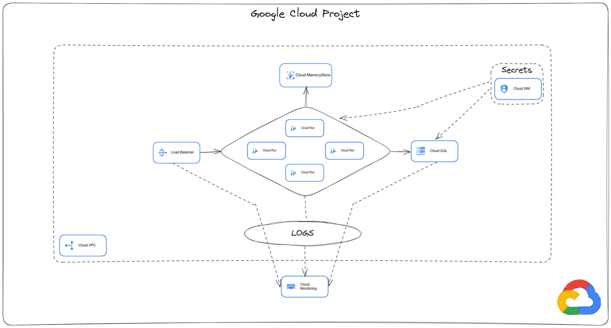

# Google Cloud Project Documentation

## Project Overview

This Google Cloud project is designed to host and manage containerized applications using **Cloud Run** while ensuring scalability, security, and monitoring. The architecture includes essential Google Cloud services such as **Cloud Load Balancer, Cloud SQL, Cloud MemoryStore, Cloud IAM, and Cloud Monitoring**.

## Architecture Components

### 1. **Load Balancer**

- Distributes traffic across multiple **Cloud Run** instances.
- Ensures high availability and reliability.

### 2. **Cloud Run**

- Runs stateless containers on demand.
- Integrated with **Cloud SQL** for database operations.
- Connected to **Cloud MemoryStore** for caching needs.

### 3. **Cloud SQL**

- Managed relational database service.
- Stores persistent application data.

### 4. **Cloud MemoryStore**

- Provides in-memory caching for improved performance.
- Reduces database query load.

### 5. **Cloud IAM (Identity & Access Management)**

- Manages access controls and permissions.
- Used for securing secrets and credentials.

### 6. **Cloud VPC (Virtual Private Cloud)**

- Provides network isolation.
- Ensures secure communication between services.

### 7. **Cloud Monitoring & Logs**

- Collects application logs and performance metrics.
- Helps in troubleshooting and performance analysis.

## Setup Instructions

### 1. Authenticate with Google Cloud:
   ```sh
   gcloud auth application-default login
   ```

### 2. Set application credentials:
   ```sh
   export GOOGLE_APPLICATION_CREDENTIALS="/home/vscode/.config/gcloud/application_default_credentials.json"
   ```

### 3. Configure Terraform Variables (tfvars)
Create a file named `terraform.tfvars` and add the following configuration:
   ```hcl
   name                      = "your-project-name"           # Name of the infrastructure deployment
   zone                      = "your-region"                # Deployment region (e.g., "us-central1")
   size                      = "deployment-size"            # Size of the deployment (e.g., "small", "medium", "large")
   replicas                  = number                       # Number of instances to run
   project_id                = "your-gcp-project-id"       # Google Cloud project ID
   deletion_protection       = false                        # Enable/disable deletion protection
   domain                    = "your-custom-domain"        # Custom domain for the deployment
   cloudflare_zone_id        = "your-cloudflare-zone-id"  # Cloudflare Zone ID for managing DNS
   docker_image              = "your-docker-image"        # Docker image to deploy (e.g., "docker.io/your-image:latest")
   backups                   = false                        # Enable/disable database backups
   availability_type         = "ZONAL"                      # Availability configuration ("ZONAL" or "REGIONAL")
   notification_channels_url = "your-notification-url"     # URL for monitoring notifications
   ```

### 4. Terraform Initialization and Deployment
#### Initialize Terraform:
   ```sh
   tofu init
   ```
#### Plan the deployment:
   ```sh
   tofu plan
   ```
#### Apply the deployment:
   ```sh
   tofu apply
   ```

## Cloudflare API Key Setup
### 1. Generate a Cloudflare API Key:
1. Go to **[Cloudflare Dashboard](https://dash.cloudflare.com/)**.
2. Navigate to **My Profile** → **API Tokens**.
3. Create a **Custom API Token** with the following permissions:
   - **Zone: DNS Edit** (to manage DNS records)
   - **Zone: Read** (to fetch domain details)
4. Set the token’s scope to your domain (e.g., `your-domain.com`).
5. Copy the generated API key and store it securely.

### 2. Export Cloudflare API Key as an Environment Variable:
   ```sh
   export CLOUDFLARE_API_TOKEN="your-cloudflare-api-key"
   ```

## Building and Deploying the Docker Image
### 1. Navigate to the Application Directory
   ```sh
   cd ./app
   ```

### 2. Build the Docker Image
   ```sh
   docker build -t your-docker-image .
   ```

### 3. Push the Image to Docker Hub
   ```sh
   docker login
   docker push your-docker-image
   ```

## Accessing Services
After the setup is complete, you can access the services using the URLs provided by **Cloud Run** and **Cloud Load Balancer** or using the domain defined in the configuration. (It will take some time for the domain to be active.)

## Troubleshooting
For issues related to **VPC connectivity**, check the following documentation: [Configuring VPC for Cloud Run](https://cloud.google.com/run/docs/configuring/vpc-direct-vpc#delete-subnet)

## Schema


---

This document provides an overview of the project architecture, essential components, setup instructions, and deployment steps. For further customizations, refer to Google Cloud documentation.

